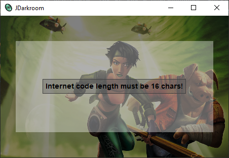

# JDarkroom
### ENG
This is a simple, completely offline reimplementation of the Darkroom website that existed<br>
a while ago, but now it is offline. Using JDarkroom you can retrieve locker code in Akuda bar.<br>
There are two ways how you can do that:
- By dropping a save file here (slot[0-4].sav)
- Enter an Internet code that you can find at the bottom of the screen when you are about to save your game.<br>

Example of an Internet code: ```fCe\w9!iBXJ1ijn&```<br>
Both Russian and English game versions are supported.

***A note***<br>
This app would not exist, if it was not this super helpful article: https://9214.github.io/13

Why did I make this if there are online websites that are much more similar to the original Darkroom?<br>
As the author of this article said, these can go offline at any time, but with this tool you don't have to<br>
worry about that, because this app will just be stored on your pc as a single file.


### РУС
Это простая, не требующая интернет-соединения программа, которая повторяет функционал сайта Darkroom,<br>
который существовал раньше, однако, теперь он больше не доступен. Используя JDarkroom вы можете получить код от шкафа в баре Акуда.<br>
Сделать это можно двумя способами:
- Перенести в окно программы файл сохранения (slot[0-4].sav)
- Ввести специальный Интернет-код, который вы можете найти внизу вашего экрана при сохранении игры.<br>

Пример Интернет-кода: ```fCe\w9!iBXJ1ijn&```<br>
Поддерживаются Английская и Русская версии игры.

***Заметка***<br>
Это приложение не существовало бы, если бы не эта суперполезная статья: https://9214.github.io/13

Зачем я создал это приложение, ведь уже существуют сайты, которые очень похожи на оригинальный Darkroom?<br>
Как сказал автор этой статьи, эти веб-сайты, так же как и оригинальный, могут быть отключены в любое время,<br>
но с этим приложением вам не стоит переживать, ведь оно просто будет находится у вас на компьютере в виде одного файла.

### Screenshots
#### You can drop save file here:


#### An example:


#### Code that resulted from ```fCe\w9!iBXJ1ijn&```:


#### If you enter wrong code:
